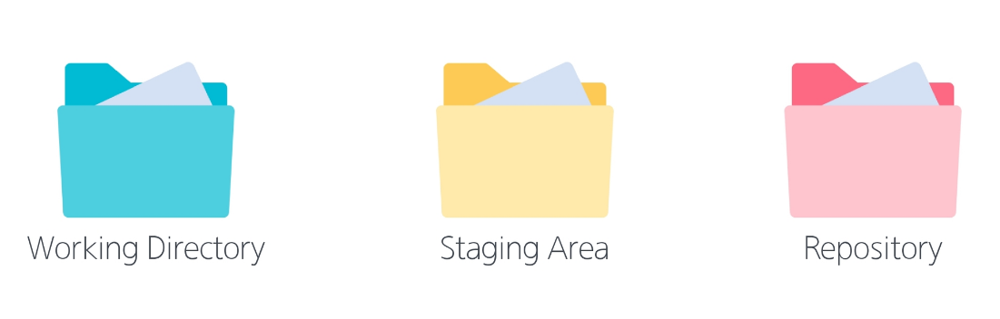

# GIT

#### 이전 버전에서 변경된 부분만 저장 -> 추후 오류 등으로 인해 수정이 필요할 때 해당 버전만 고치면 됨

## 중앙 집중식 버전 관리
- 버전은 중앙 서버에 저장되고, 중앙 서버에서 파일을 가져와 다시 중앙에 업로드

### 기존 중앙 집중식 버전 관리의 문제점
- 중앙 서버에 문제가 생길 경우 복구 불가
- 중앙 서버에 접속해야만 파일을 가져오거나 버전을 기록할 수 있어, 인터넷이 없으면 작업 자체가 불가능
- 여러 사람이 동시에 작업할 경우, 충돌이 빈번하게 발생하며 충돌 해결을 중앙 서버에서만 처리해야함

## 분산식 버전 관리
- 버전을 여러 개의 복제된 저장소에 저장 및 관리

### 분산식 버전 관리의 장점
- 중앙 서버에 의존하지 않고도 동시에 다양한 작업을 수행할 수 있음 (백업과 복구에 용이)
- 중앙 서버에서 가져온 파일을 서로 다르게 수정하여 동시에 업로드 하더라도, 원본을 해칠 염려가 없음
- 인터넷에 연결되지 않은 환경에서도 작업을 계속할 수 있음
- 인터넷에 연결되지 않은 환경에서도, 변경 이력과 코드를 로컬 저장소에 기록하고 후에 중앙 서버와 동기화하여 작업을 게속 할 수 있음

---

## GIT(분산 버전 관리 시스템)
- 코드의 '변경 이력'을 기록하고, '협업'을 원활하게 하는 도구

### git의 3가지 영역

- `Working Directory` : 실제 작업 중인 파일들이 위치하는 영역

- `Staging Area` : `Working Directory`에서 변경된 파일 중, 다음 버전에 포함시킬 파일들을 선택적으로 추가하거나 제외할 수 있는 중간 준비 영역. 버전을 `Repository`에 `Commit` 할 때마다 `Staging Area`는 비워짐

- `Repository` : 버전 이력과 파일들이 영구적으로 저장되는 영역으로, 모든 버전과 변경 이력이 기록됨
