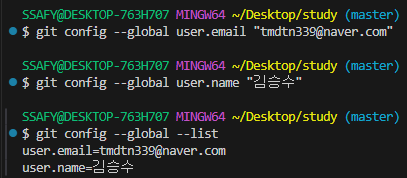

# GIT

#### 이전 버전에서 변경된 부분만 저장 -> 추후 오류 등으로 인해 수정이 필요할 때 해당 버전만 고치면 됨

## 1. 중앙 집중식 버전 관리
- 버전은 중앙 서버에 저장되고, 중앙 서버에서 파일을 가져와 다시 중앙에 업로드

### 기존 중앙 집중식 버전 관리의 문제점
- 중앙 서버에 문제가 생길 경우 복구 불가
- 중앙 서버에 접속해야만 파일을 가져오거나 버전을 기록할 수 있어, 인터넷이 없으면 작업 자체가 불가능
- 여러 사람이 동시에 작업할 경우, 충돌이 빈번하게 발생하며 충돌 해결을 중앙 서버에서만 처리해야함

## 2. 분산식 버전 관리
- 버전을 여러 개의 복제된 저장소에 저장 및 관리

### 분산식 버전 관리의 장점
- 중앙 서버에 의존하지 않고도 동시에 다양한 작업을 수행할 수 있음 (백업과 복구에 용이)
- 중앙 서버에서 가져온 파일을 서로 다르게 수정하여 동시에 업로드 하더라도, 원본을 해칠 염려가 없음
- 인터넷에 연결되지 않은 환경에서도 작업을 계속할 수 있음
- 인터넷에 연결되지 않은 환경에서도, 변경 이력과 코드를 로컬 저장소에 기록하고 후에 중앙 서버와 동기화하여 작업을 게속 할 수 있음

---

## 3. GIT(분산 버전 관리 시스템)
- 코드의 '변경 이력'을 기록하고, '협업'을 원활하게 하는 도구

### git의 3가지 영역

- `Working Directory` : 실제 작업 중인 파일들이 위치하는 영역

- `Staging Area` : `Working Directory`에서 변경된 파일 중, 다음 버전에 포함시킬 파일들을 선택적으로 추가하거나 제외할 수 있는 중간 준비 영역. 버전을 `Repository`에 `Commit` 할 때마다 `Staging Area`는 비워짐
  
  - `Commit` : 변경된 파일들을 저장하는 행위

- `Repository` : 버전 이력과 파일들이 영구적으로 저장되는 영역으로, 모든 버전과 변경 이력이 기록됨

---
## 4. 실습

- `git init`을 통해 git 시작
- `git add ~~` 를 통해 Woriking Directory에 있는 파일을 Staging Area에 옮기기
  - 현재 directory에 있는 모든 파일을 add 하려면 `git add .`
- `git status`를 통해 확인 가능

---

- `git commit -m "이름"` 으로 commit하려 했으나, authority 필요

---

- `git config --global user.email "이메일"`, `~~ "이름"`을 통해 본인 인증
  - 본인이 아니라면 push가 안됨
- `--global` 은 이 컴퓨터 내 모든 authority를 작성한 계정으로 이용한다는 뜻

---

- commit 완료
- 잘못 commit 하였을 경우, `git restore --staged 파일명`

---

## 5. 원격 저장소
- `git remote add origin remote_repo_url`
  - `git remote` : 로컬 저장소에 원격 저장소 추가
  - `add origin` : 별칭을 사용해 로컬 저장소 한 개에 여러 원격 저장소를 추가 할 수 있음
  - `remote_repo_url` : 추가하는 원격 저장소의 URL
  - `git push origin master` : 원격 저장소에 commit 목록을 업로드
    - commit 이력이 없다면 push 불가

  - `git pull origin master` : 원격 저장소의 변경사항만을 받아옴(업데이트)
  - `git clone remote_repo_url` : 원격 저장소 전체를 복제(다운로드)
    - 한 번 clone하고 나면 또 할 필요가 없음

---
  <요약>

  #### init -> 작업 -> add -> commit -> push
  #### (다른 곳에서 진행 시) -> pull
---

- push가 불가능한 상황
  - 내 컴퓨터에서의 commit 내역과 원격 저장소와의 commit 내역이 다를 때

- 해결? : git pull 먼저 실행
  - vim창 뜨는데 `:q`로 나가기
  - 로컬과 원격 저장소의 내역을 합쳐진 새로운 commit이 생김

---

## 6. Branch
- Branch 장점
  
  1. 독립된 개발 환경을 형성하기 때문에 원본(master)에 대해 안전
  2. 하나의 작업은 하나의 브랜치로 나누어 진행되므로 체계적으로 협업과 개발이 가능
  3. 손쉽게 브랜치를 생성하고 브랜치 사이를 이동할 수 있음

- Branch Command
  - `git branch -c (이름)` : (이름)으로 branch create
  ---
  - `git branch`를 통해 확인

  
  ---
  - `git switch (이름)` : 독립된 작업공간으로 이동
  
  ---
  - `git merge (이름)` : (master 공간에서 해야함) (이름)이 작업한 것들을 merge
  
  ---
  - `git branch -d (이름)` : 작업 완료 후 branch 삭제
  ---
  
  - 초기설정(master가 실행) > viktor가 먼저 login기능 생성(fast forward) > harry가 그 다음 article 작업 완료(harry 입장에서는 초기설정 다음 바로 했지만, three way merge. 따라서 vim이 켜짐)